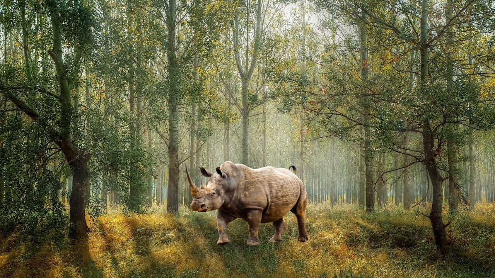
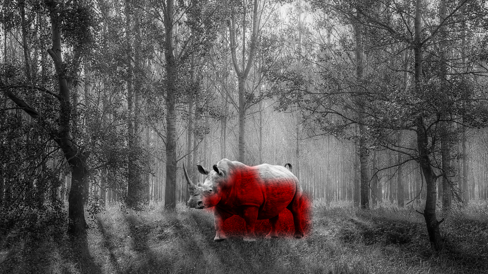

# ForgeryDetection
MVA project with Alexis Groshenry: Forgery Detection in Images. Our method relies on Discrete Cosine Transforms (DCT) and noise estimation.    

|  |   |
|:--:| :--:| 
| Input image | Forgery detection (binary mask)  | 

